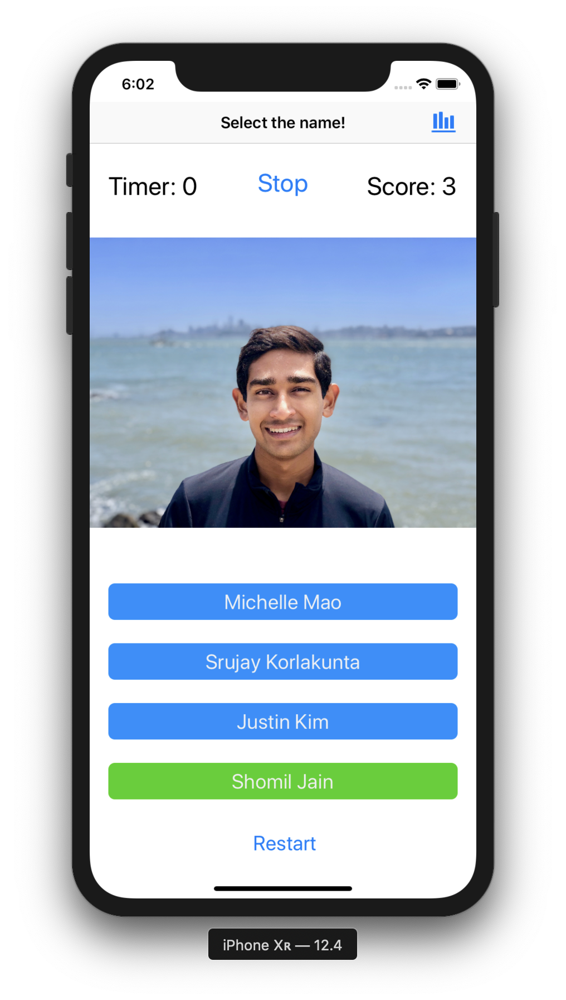
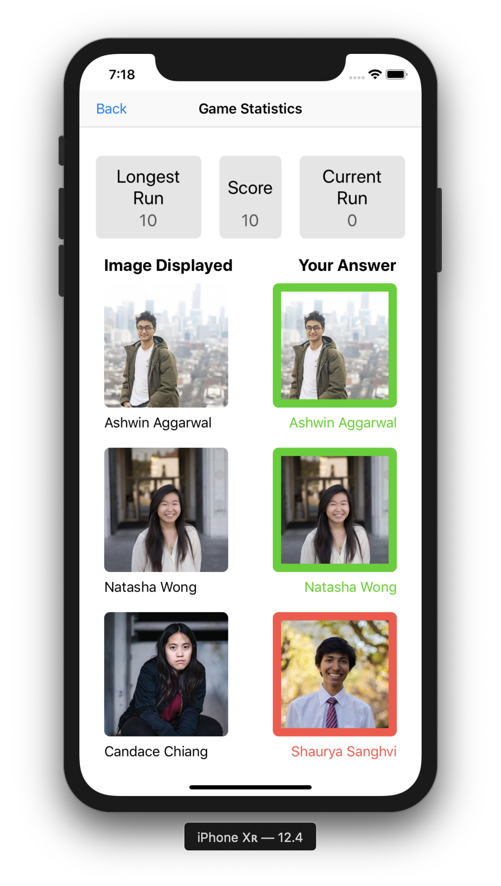
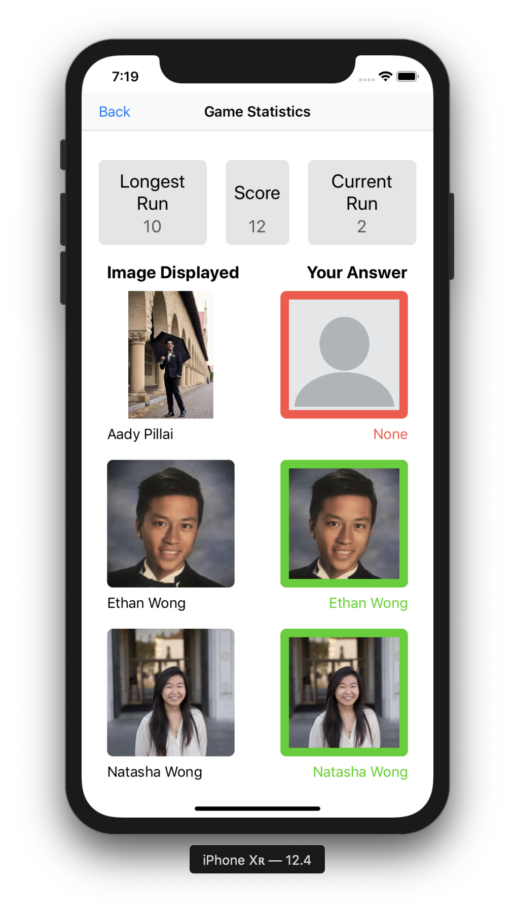

# MDB Mini Project 1
In this game, the player must select the right name for the corresponding picture displayed within five seconds. This way, players can learn the names and faces of all MDB members. Once the player selects the name they think is correct, they will be told with a green or red color if they were correct. Users can also view their game statistics, including their score, longest run of correct answers, current run of correct answers, and their last three answers.

The page where users indicate the correct name

The page where users can see game statistics

User is unable to answer question in 5 seconds
